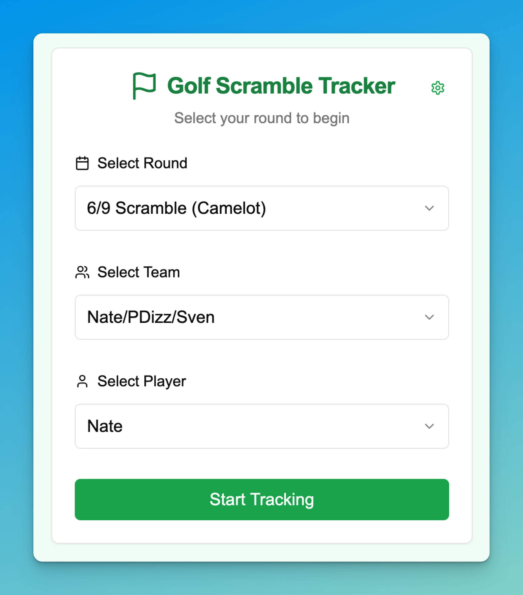
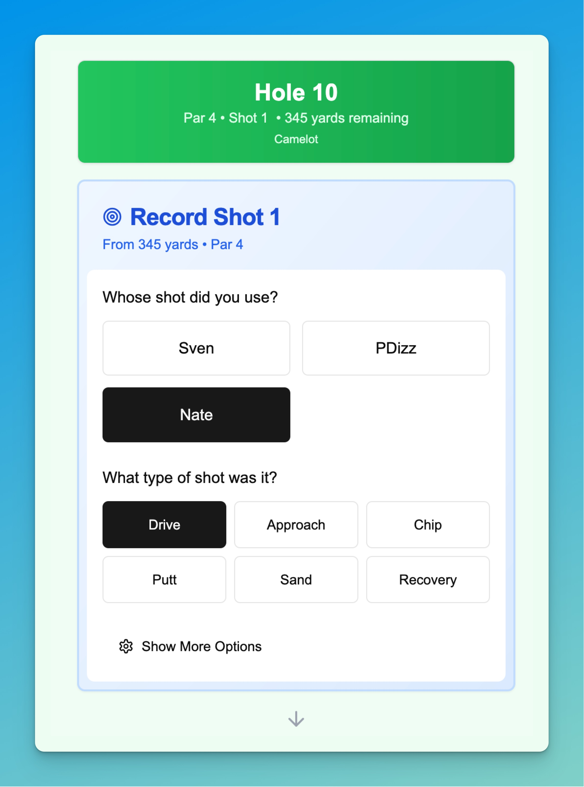
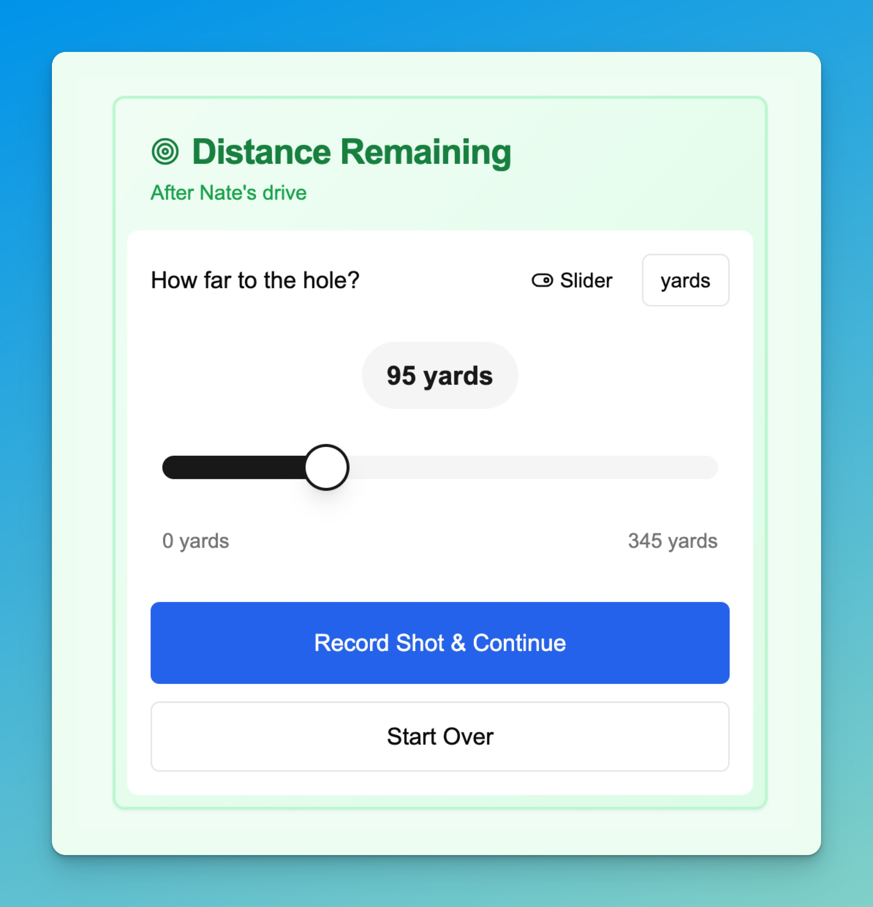
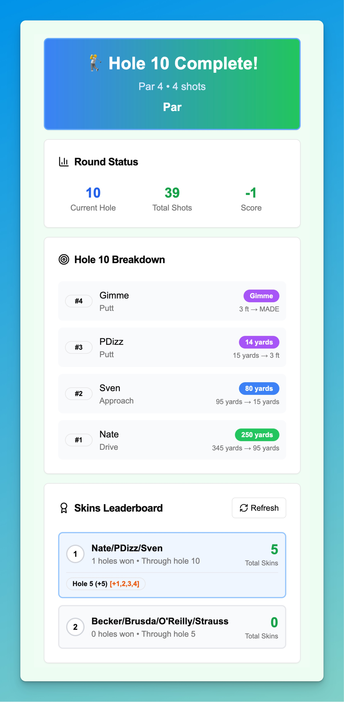
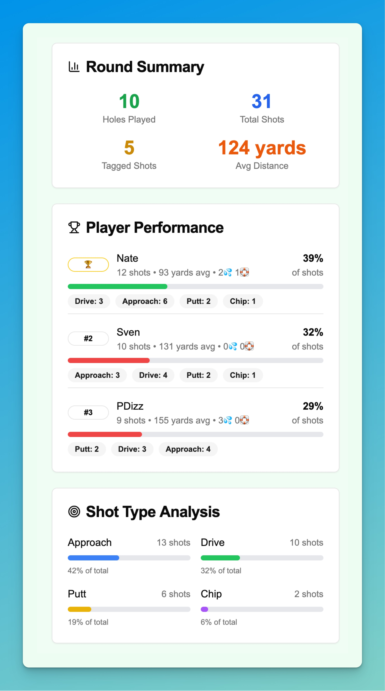

# ⛳ Golf Shot Tracker

A mobile-friendly app for tracking golf scramble tournaments. Keep track of every shot, see live stats, and compete with other teams in real-time!

## What is this?

This app helps you track shots during golf scrambles. Instead of just keeping score, you'll track every shot your team takes - who hit it, what type of shot, and how far it went. The app calculates stats, shows live leaderboards, and keeps track of skins/money owed.

## ✨ Key Features

- 📱 **Works on your phone** - Install it like a native app, works offline
- ⛳ **Track every shot** - Distance, shot type, player, and special moments
- 📊 **Live stats** - See how your team is doing (score, skins, money) in real-time
- 📈 **Post-round analysis** - Detailed breakdown of shots used per person

## 🎯 How it works

### 1. Start your round
Pick your event, select your team, and choose who you are.

### 2. Track shots as you play
After each shot (before on tee shots) you enter:
- Distance to the pin
- Who's shot you just used
- Type of shot (drive, approach, putt, etc.)

 

### Holing Out
If a shot went in, click the hole out button. This will take you to the next hole.

### Gimme's
If you hit a shot really close to the pin (so the next shot is a gimme). Click "to gimme". This will add one stroke (for the gimme) and take you to the next hole.

If you hit it really close but forget to click the "to gimme" button, you can mark the shot as a gimme on the next hoel too.

Note gimme putts aren't assigned to any one player since anyone can make them.

### 3. See your progress
After each hole, the app will show where you're at.

### 4. Live Feed
At any time, click the trophy at the top to see a live feed of how every team is doing.

### 5. View stats
Or click the bar chart icon on the right to see a team breakdown.

## 🚀 Getting Started

1. **Open the app** in your phone's browser
2. **Install it** - Look for "Add to Home Screen" or "Install App" 
3. **Select your round** - Choose from the available tournaments
4. **Pick your team** - Find your team name in the list
5. **Choose yourself** - Select your name from your team
6. **Start tracking!** - Begin with hole 1

## 📱 Tips

- **One person per team** should track shots to avoid conflicts
- **Enter distances as you see them** - the app handles the math
- **Use the emoji tags**, 💦 for nut shots, 🛟 for clutch shots (the shot used was the only good one)
- **Check the live feed** between holes to see how you're doing

## 🎮 During Your Round

### Starting each hole
- Enter the distance to the pin from your tee shot location
- Hit "Start Hole" to begin tracking

### Recording shots
- Select who's shot you used
- Choose the shot type (Drive, Approach, Chip, Putt, etc.)
- Enter the remaining distance
- Add emoji tags for memorable shots
- Hit "Record Shot"

